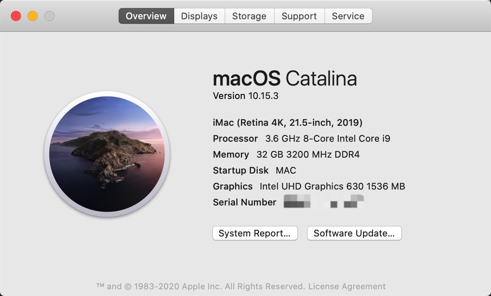

# Mojave EFI folder for i7-9700k & MSI z390 gaming pro carbon

> This branch is for Catalina, checkout [*Mojave here*](https://github.com/cangzhang/efi-for-9700k-msi-z390-gaming-pro-carbon/tree/mojave)

~~**Make sure your bios version is [7B17v10](http://download.msi.com/bos_exe/mb/7B17v10.zip), otherwise the installation would never be completed!**~~

## Update to latest MSI BIOS version

Of course you can, I've included this patch [from here.](https://www.tonymacx86.com/threads/fix-for-boot-hangs-after-bios-update-acpi-patch.275091)

## Use `AptioMemoryFix`

`OsxAptioFix2Drv-free2000` [may can cause your mobo to be bricked or even damage components](https://www.reddit.com/r/hackintosh/comments/cfjyla/i_unleashed_a_plague_upon_you_guys_and_i_am_sorry).
You can replace it with `AptioMemoryFix` following this guide [300系列主板正确使用AptioMemoryFix.efi的姿势 重写版](https://blog.xjn819.com/?p=317) ([backup](https://archive.is/pmNaB)), tools are here [enable-AptioMemoryFix](./enable-AptioMemoryFix).

# Fill your own slide value

`slide=0` works, but it's better to find out the value best for your mobo.
